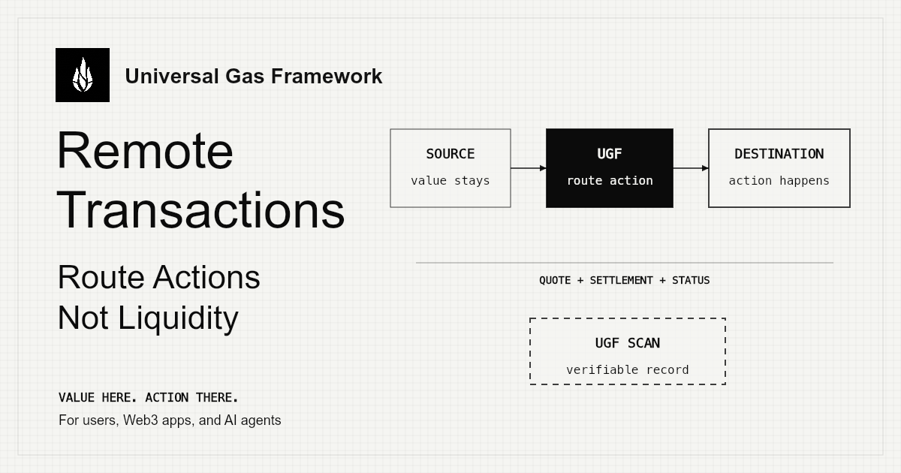

# @tychilabs/ugf-sdk

[](https://www.npmjs.com/package/@tychilabs/ugf-sdk)
[](./LICENSE)
[](https://www.npmjs.com/package/@tychilabs/ugf-sdk)



Execution layer for remote transactions.

Users and AI agents can act on supported blockchains without depending on each chain's gas token.

UGF is not wallet. Not paymaster. Not gas tool.

UGF sits between where value lives and where action needs to happen, then routes transaction instead of making user move liquidity first.

This SDK gives wallets, apps, and agents access to that mainnet execution flow.

No paymasters. No bundlers. No ERC-4337. No Smart Wallets.

---

## What Is UGF

UGF is cross-chain gas abstraction for remote transactions.

User has value on one chain. User wants action on another. UGF prices route, collects payment on supported rail, then completes destination execution.

Normally: user has no gas token on destination chain -> action stops.

With UGF: user pays with supported asset on supported payment chain -> UGF completes action on destination chain.

```text
Value here.  ->  UGF routes.  ->  Action there.
```

Main lifecycle:

1. Authenticate
2. Quote
3. Pay
4. Execute

Payment chain and destination chain are separate parts of same route.

---

## Why Teams Use UGF

**Wallets** — ship cross-chain actions without asking users to first buy destination gas.

**dApps** — remove gas friction from swap, mint, vote, transfer, and contract-call flows.

**AI agents** — execute across chains without maintaining gas inventory everywhere.

**Protocol teams** — integrate one execution layer instead of stitching together paymasters, relayers, and custom chain-specific gas logic.

---

## Mainnet Coverage

| Field | Value |
| ----- | ----- |
| Environment | Mainnet |
| Payment modes | `x402`, `vault` |
| Destination chains | `evm`, `sol`, `sui`, `tron` |
| Payment assets | dynamic from registry / quote |
| Gateway | `https://gateway.universalgasframework.com` |

Current payment assets include **USDC, EURC, $U (United Stables), ETH, MATIC, AVAX, BNB**.

Treat `GET /tokens/registry` and quote response as source of truth for live routes.

---

## Install

```bash
npm install @tychilabs/ugf-sdk
```

Peer dependencies — install only what you need:

```bash
npm install ethers                          # required for auth + EVM payment flows
npm install @mysten/sui                     # Sui execution only
npm install @solana/web3.js                 # Solana execution only
```

Tron note: no Tron peer dependency is required unless you want your own Tron client (for example `tronweb`) for local signing and broadcast.

---

## Quick Start

### EVM -> EVM

```ts
import { UGFClient } from "@tychilabs/ugf-sdk";
import { ethers } from "ethers";

const client = new UGFClient({
  baseUrl: "https://gateway.universalgasframework.com",
});

const wallet = new ethers.Wallet(PRIVATE_KEY, provider);

await client.auth.login(wallet);

const quote = await client.quote.get({
  payment_coin: "USDC",
  payer_address: wallet.address,
  payment_chain: "8453",
  payment_chain_type: "evm",
  tx_object: JSON.stringify({ from, to, data, value }),
  dest_chain_id: "56",
  dest_chain_type: "evm",
});

await client.payment.x402.execute({ quote, signer: wallet, token: "USDC" });

await client.chains.evm.execute({
  quote,
  signer: wallet.connect(destProvider),
});
```

### EVM -> Solana

```ts
const quote = await client.quote.get({
  payment_coin: "USDC",
  payer_address: wallet.address,
  payment_chain: "8453",
  payment_chain_type: "evm",
  tx_object: JSON.stringify({
    sol_address: USER,
    transfer_type: "custom",
    tx_base64: txBase64,
  }),
  dest_chain_id: "sol-mainnet",
  dest_chain_type: "sol",
});

await client.payment.x402.execute({ quote, signer: wallet, token: "USDC" });

await client.chains.sol.sponsorCustomTx(
  quote.digest,
  keypair,
  connection,
  buildTx,
);
```

### EVM -> Sui

```ts
const quote = await client.quote.get({
  payment_coin: "USDC",
  payer_address: wallet.address,
  payment_chain: "8453",
  payment_chain_type: "evm",
  tx_object: JSON.stringify({ sui_address: USER, tx_kind_b64: txKindB64 }),
  dest_chain_id: "sui-mainnet",
  dest_chain_type: "sui",
});

await client.payment.x402.execute({ quote, signer: wallet, token: "USDC" });

await client.chains.sui.execute({
  digest: quote.digest,
  keypair,
  rpcUrl: SUI_RPC,
});
```

### EVM -> Tron

```ts
const txObject = client.chains.tron.createTrxTransferTxObject({
  tronAddress: TRON_FROM,
  to: TRON_TO,
  amount: "1000000", // 1 TRX in sun
});

// Check if UGF sponsorship is needed before sending TRX
const assessment = await client.chains.tron.assessTrxTransfer({
  rpcUrl: TRON_RPC,
  fromAddress: TRON_FROM,
  toAddress: TRON_TO,
});

if (!assessment.requiresSponsorship) {
  await sendTrxViaYourTronStack();
} else {
  const quote = await client.quote.get({
    payment_coin: "USDC",
    payer_address: wallet.address,
    payment_chain: "8453",
    payment_chain_type: "evm",
    tx_object: JSON.stringify(txObject),
    dest_chain_id: "tron-mainnet",
    dest_chain_type: "tron",
  });

  await client.payment.x402.execute({ quote, signer: wallet, token: "USDC" });

  await client.chains.tron.sponsorAndBroadcastTrx({
    digest: quote.digest,
    sendTx: async () => {
      return sendTrxViaYourTronStack();
    },
  });
}
```

---

## Execution Lifecycle

```text
1. Authenticate
   auth.login -> wallet signature -> JWT

2. Quote
   quote.get -> POST /quote -> digest + payment amount + route details

3. Pay
   payment.x402.execute or payment.vault -> settle on payment chain

4. Execute
   chains.evm / chains.sol / chains.sui / chains.tron

5. Confirm
   status completed -> destination action done
```

Each stage has one job:

- **Authenticate** — prove payer wallet ownership
- **Quote** — price destination action
- **Pay** — settle on supported payment rail
- **Execute** — complete sponsored action on destination chain
- **Confirm** — verify route completed

---

## SDK Surface

```ts
client.auth; // authenticate signer
client.registry; // discover live payment assets and chains
client.quote; // price a destination action
client.payment.x402; // settle via x402
client.payment.vault; // settle via vault payment
client.status; // poll route completion
client.chains.evm; // EVM destination execution
client.chains.sol; // Solana destination execution
client.chains.sui; // Sui destination execution
client.chains.tron; // Tron helpers + sponsorship wait flow
```

`UGFClient` is main entry point. You usually create one client, authenticate payer wallet, ask for quote, pay quote, then call destination chain helper.

If you want quick mental model:

- `auth` handles login and JWT storage
- `registry` tells you what payment assets and chains are live
- `quote` prices one destination action
- `payment` settles that quote
- `status` lets you poll route progress
- `chains` finishes destination-side flow for each chain family

## Available Functions

### `client.auth`

Use `auth` when you need wallet login before quote, payment, or status actions.

| Function | What it does | When to use it |
| -------- | ------------ | -------------- |
| `getNonce(address)` | Fetches login nonce for wallet address. | Use when you want to control signing flow yourself. |
| `login(signer)` | Signs UGF login message with ethers signer, sends it to gateway, stores returned JWT automatically. | Use this in most EVM login flows. |
| `loginRaw(address, nonce, signature)` | Finishes login using externally produced signature instead of calling `signer.signMessage()` inside SDK. | Use when wallet signing happens outside SDK. |
| `setToken(token)` | Stores existing JWT on client. | Use when your backend or another session already gave you valid token. |
| `getToken()` | Returns currently stored JWT or `null`. | Use for debugging or token reuse. |

### `client.registry`

Use `registry` to discover live assets, supported chains, receiver addresses, and vault contracts.

| Function | What it does | When to use it |
| -------- | ------------ | -------------- |
| `get()` | Fetches full registry from gateway and caches it locally. | Use when you want all live payment options. |
| `invalidate()` | Clears local registry cache. | Use when you want fresh registry data after route changes. |
| `getOption(token)` | Returns one payment option such as `USDC`, `EURC`, or `$U`. | Use when your UI starts from token choice. |
| `getChainEntry(token, chainId)` | Returns token details for one specific chain, including token address and vault address when available. | Use when you are about to pay on one known chain. |
| `getVaultAbi()` | Returns parsed vault ABI from registry. | Use only if you need vault contract details directly. |

### `client.quote`

Use `quote` to convert one destination action into a priced UGF route.

| Function | What it does | When to use it |
| -------- | ------------ | -------------- |
| `get(req)` | Sends `POST /quote` and returns digest, payment amount, payment mode, and any chain-specific fields needed for execution. | Use for every route before payment. |

`QuoteRequest` is where you describe whole route:

- `payment_coin` = asset user will pay with
- `payer_address` = address paying on payment chain
- `payment_chain` and `payment_chain_type` = where payment happens
- `tx_object` = destination action as JSON string
- `dest_chain_id` and `dest_chain_type` = where action should execute

### `client.status`

Use `status` when you want route progress or completion state.

| Function | What it does | When to use it |
| -------- | ------------ | -------------- |
| `get(digest)` | Fetches current route status one time. | Use for manual polling or dashboards. |
| `poll(digest, opts)` | Keeps polling until route completes, fails, or expires. | Use in most post-payment flows. |
| `waitForUserSig(digest, opts)` | Polls until route reaches `awaiting_user_sig`. | Use for Solana and Sui flows where user signature is needed after sponsor preparation. |

`PollOptions` lets you control:

- `maxAttempts` = how many polls before timeout
- `intervalMs` = delay between polls
- `onTick` = callback on each poll result

### `client.payment.x402`

Use `x402` when payment happens through off-chain signature authorization rather than direct on-chain vault payment.

| Function | What it does | When to use it |
| -------- | ------------ | -------------- |
| `sign(quote, signer, provider, opts)` | Builds x402 payload by finding correct token from registry, signing ERC-3009 typed data, and returning payload without submitting it. | Use when you want split flow: sign now, submit later. |
| `submit(payload)` | Sends signed x402 payload to gateway. | Use when payload already exists. |
| `signAndSubmit(quote, signer, provider, opts)` | Signs x402 payload and submits it in one step. | Use when you want full x402 flow but still control provider explicitly. |
| `execute({ quote, signer, opts })` | Simplest x402 path. Reads provider from signer, signs, then submits. | Use in most app integrations. |

`X402Options` currently supports:

- `validForSeconds` = signature validity window

### `client.payment.vault`

Use `vault` when payment is done by sending native value to supported vault contract on payment chain.

| Function | What it does | When to use it |
| -------- | ------------ | -------------- |
| `pay(quote, signer, chainId, token)` | Finds vault from registry, calls `payForFuel`, waits for receipt, then returns vault payment payload. | Use when you want on-chain payment first and submission second. |
| `submit(payload)` | Sends vault payment payload to gateway. | Use when vault transaction already happened. |
| `payAndSubmit(quote, signer, chainId, token)` | Runs full vault payment flow in one call. | Use in most native vault integrations. |

### `client.chains.evm`

Use EVM chain helper when destination action is EVM execution.

| Function | What it does | When to use it |
| -------- | ------------ | -------------- |
| `waitForCompletion(digest, opts)` | Waits until UGF route is complete. | Use when you only need final status. |
| `sponsorAndExecute(digest, signer, buildTx, opts)` | Waits for sponsorship, lets your app build and send destination EVM tx, then confirms tx hash back to UGF. | Use for normal EVM destination execution flow. |

### `client.chains.sol`

Use Solana chain helper when destination action lands on Solana.

| Function | What it does | When to use it |
| -------- | ------------ | -------------- |
| `sponsorSolTransfer(digest, keypair, opts)` | Waits for UGF-prepared SOL transfer, signs required user part, submits signature, then waits for completion. | Use for native SOL transfer route. |
| `sponsorSplTransfer(digest, keypair, opts)` | Same pattern for SPL token transfer. | Use for SPL token route. |
| `sponsorCustomTx(digest, keypair, connection, buildTx, opts)` | Waits for UGF funding step to finish, then your app builds and broadcasts its own custom Solana transaction. | Use for custom Solana action after sponsor funding. |

### `client.chains.sui`

Use Sui chain helper when destination action lands on Sui.

| Function | What it does | When to use it |
| -------- | ------------ | -------------- |
| `execute({ digest, keypair, rpcUrl, onTick })` | Polls until sponsor tx bytes and sponsor signature are ready, signs with user keypair, then executes sponsored Sui transaction block. | Use for standard Sui execution flow. |

### `client.chains.tron`

Use Tron chain helper when destination action lands on Tron. Tron flow is different from EVM, Solana, and Sui because your app still owns final signing and broadcast.

| Function | What it does | When to use it |
| -------- | ------------ | -------------- |
| `createTrxTransferTxObject(params)` | Builds quote payload for native TRX transfer. | Use before `quote.get()` for TRX route. |
| `createTrc20TransferTxObject(params)` | Builds quote payload for TRC20 transfer. | Use before `quote.get()` for TRC20 route. |
| `getResources(rpcUrl, address)` | Reads available bandwidth and energy from Tron RPC. | Use for balance-like resource checks. |
| `isAccountUnactivated(rpcUrl, address)` | Checks whether recipient account is activated on Tron yet. | Use for TRX activation-cost logic. |
| `getNetworkCosts(rpcUrl)` | Reads chain parameters and estimates bandwidth cost and activation cost. | Use when you want visibility into current Tron execution requirements. |
| `assessTrxTransfer({ rpcUrl, fromAddress, toAddress })` | Decides whether TRX transfer needs sponsorship because of activation or bandwidth. | Use before quoting TRX flow. |
| `assessTrc20Transfer({ rpcUrl, fromAddress, requiredEnergy, requiredBandwidth })` | Decides whether TRC20 transfer needs sponsorship because of missing bandwidth or energy. | Use before quoting TRC20 flow. |
| `waitForCompletion(digest, opts)` | Waits until Tron sponsorship route is complete. | Use when you want final status only. |
| `sponsorAndBroadcastTrx({ digest, sendTx, opts })` | Waits for sponsorship, then calls your Tron send function and returns `txId` with final status. | Use for native TRX flow when sponsorship is needed. |
| `sponsorAndBroadcastTrc20({ digest, sendTx, opts })` | Same pattern for TRC20 transfer. | Use for TRC20 flow when sponsorship is needed. |

### Errors You Will See

SDK throws typed errors for common failure cases:

- `UGFError` = base SDK error
- `UGFAuthError` = login/auth failure
- `UGFTimeoutError` = polling timeout
- `UGFSignatureError` = signing or signature validation failure

Most route failures also include machine-friendly `code` values such as `QUOTE_ERROR`, `TX_FAILED`, `TX_EXPIRED`, `NO_PROVIDER`, `VAULT_TX_FAILED`, or Tron-specific RPC errors.

---

## Route Discovery

Payment options are returned dynamically under `payment_options`.

```ts
GET https://gateway.universalgasframework.com/tokens/registry
```

Use quote response for exact pricing and exact payment mode for that transaction.

---

## Gateway Endpoints

```text
GET  /health
GET  /auth/nonce?address=<address>
POST /auth/wallet-login
GET  /tokens/registry
POST /quote
POST /payment/submit
GET  /status?digest=<digest>
POST /evm/confirm
```

---

## Tron Support

Tron support in this SDK is helper-first.

- SDK builds Tron `tx_object`
- SDK checks bandwidth, energy, and activation state
- SDK waits until sponsorship is ready
- your app signs and broadcasts final Tron transaction

Main helpers:

```ts
client.chains.tron.createTrxTransferTxObject(...)
client.chains.tron.createTrc20TransferTxObject(...)

await client.chains.tron.getResources(rpcUrl, address)
await client.chains.tron.getNetworkCosts(rpcUrl)
await client.chains.tron.isAccountUnactivated(rpcUrl, address)

await client.chains.tron.assessTrxTransfer({
  rpcUrl,
  fromAddress,
  toAddress,
})

await client.chains.tron.assessTrc20Transfer({
  rpcUrl,
  fromAddress,
  requiredEnergy,
  requiredBandwidth,
})

await client.chains.tron.sponsorAndBroadcastTrx({
  digest,
  sendTx: async () => txId,
})

await client.chains.tron.sponsorAndBroadcastTrc20({
  digest,
  sendTx: async () => txId,
})
```

Tron flow rules:

- bring your own Tron RPC URL
- bring your own Tron signing and broadcast implementation
- `trx_transfer` sponsorship depends on receiver activation and sender bandwidth
- `trc20_transfer` sponsorship depends on sender bandwidth and energy
- if sponsorship is not needed, skip UGF payment flow and send directly

---

## Browser / Vite Setup

> Vite 8+ (Rolldown) not yet supported. Use Vite 5.

```bash
npm install vite@5 @vitejs/plugin-react@4
npm install -D vite-plugin-node-polyfills
```

```ts
// vite.config.ts
import { nodePolyfills } from "vite-plugin-node-polyfills";

export default defineConfig({
  plugins: [
    react(),
    nodePolyfills({
      include: ["buffer", "process", "crypto"],
      globals: { Buffer: true, process: true },
    }),
  ],
});
```

---

## Examples

See [`examples/`](./examples) for runnable scripts:

- [`evm-vault.ts`](./examples/evm-vault.ts) — EVM vault payment
- [`sol-transfer.ts`](./examples/sol-transfer.ts) — Solana SOL transfer
- [`sol-spl.ts`](./examples/sol-spl.ts) — Solana SPL token transfer
- [`sol-custom.ts`](./examples/sol-custom.ts) — Solana custom transaction
- [`sui-transfer.ts`](./examples/sui-transfer.ts) — Sui transaction

Tron support is available in SDK. Runnable Tron examples are not in `examples/` yet.

---

## Compatibility

| Environment | Status |
| ----------- | ------ |
| Node.js 18+ | Full support |
| Vite 5 (React / Vue) | With polyfills |
| Vite 8+ | Pending Rolldown ecosystem |
| React Native | Coming soon |

---

## About

This is production SDK for UGF mainnet.

[Tychi Labs](https://tychilabs.com) builds UGF — cross-chain gas abstraction infrastructure for wallets, apps, and agents. UGF is value-to-action routing: source-chain value authorizes destination-chain execution, without destination-chain setup.


- Execution proof: [ugfscan.com](https://ugfscan.com)
- Docs: [universalgasframework.com](https://universalgasframework.com)
- X: [@TychiLabs](https://x.com/TychiLabs)
- Telegram: [@singhy4sh](https://t.me/TychiCommunity)
- Issues: [ugf-sdk-v2/issues](https://github.com/TychiWallet/ugf-sdk-v2/issues)
- Email: [yash@tychilabs.com](mailto:yash@tychilabs.com)
